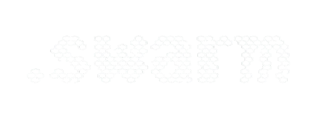

<div align="center">
  
  <h1>dot_swarm</h1>
  <p><strong>Minimal, git-native, markdown-first agent orchestration for multi-repo organizations.</strong></p>
</div>

---

## Multi-Actor Coordination: A Common Problem

Modern software teams use multiple AI coding agents simultaneously across different
platforms. Without coordination:

- Two agents work on the same task simultaneously
- Context is lost when chat history is compacted
- Non-obvious decisions (why approach A over B) disappear forever
- No agent knows what the previous agent did or decided

Existing solutions (Jira, Linear, GitHub Issues) require web UIs and API credentials.
Database-backed tools add binary files and server processes to your repo.

**dot_swarm takes a different approach: everything is a markdown file any agent on any
platform can read and write directly.**

---

## Stimergic Systems: Nature's Answer 

In nature, central coordinators are rarely used — and when they exist, they do not
actively manage coordination.

A bee queen does not dispatch workers or resolve conflicts. She emits chemical markers
that encode colony state, and workers read those traces autonomously to decide what to
do next. An ant queen does the same. The result is not top-down management — it is
**multi-master consensus through a shared medium**. Hives split into independent
sub-colonies. Ant colonies form task-specialized sub-teams. Neither requires a central
node approving every action.

The key property that makes this work: **all members speak the same chemical language.**
Every worker interprets pheromone gradients the same way. The signal is the protocol.

The cost of a central coordinator is not just latency — it is **information overload and
single-point fragility**. A queen who had to consciously route every foraging decision
would saturate immediately. The colony would slow to the speed of one brain.

dot_swarm applies this directly to software agent fleets:

!!! quote "The core principle"
    Agents that modify filesystem-native projects should leave traces in their
    environment for collaborative purposes, rather than reporting to a central node
    around which complicated systems must be arranged to prevent bottlenecks and
    data loss from information overload.

The `.swarm/` directory *is* the shared medium. `state.md` *is* the pheromone trail.
`BOOTSTRAP.md` *is* the chemical language every agent reads first. As long as agents
follow the same protocol, coordination emerges from the environment — no coordination
service required.

**Signals decay.** Pheromone trails evaporate when not reinforced. dot_swarm reflects
this: `swarm audit` flags stale claims, `memory.md` entries are dated, and `state.md`
timestamps tell any agent exactly how fresh the picture is. Old signals stop misleading
new workers.

---

## How It Works

### The `.swarm/` Directory

Every repository gets a `.swarm/` directory with five files:

| File | Role |
|------|------|
| `BOOTSTRAP.md` | Universal agent protocol — every agent reads this first |
| `context.md` | What this project is, its constraints, its architecture |
| `state.md` | Current focus, active items, blockers, handoff note |
| `queue.md` | Work items with claim stamps |
| `memory.md` | Non-obvious decisions and rationale (append-only) |

### The Pheromone Trail

Agents leave state traces (`state.md` updates) that guide successor agents without
direct communication. The next agent reads `state.md` first — it tells you exactly
where things stand in one glance. This is **stigmergy**: coordination via environment
modification, not via message passing.

### The Claim Pattern

Work items use inline stamps for optimistic concurrency — no lock server needed:

```markdown
## Active
- [>] [CLD-042] [CLAIMED · claude-code · 2026-03-26T14:30Z] Fix Redis timeout
      priority: high | project: cloud-stability

## Pending
- [ ] [CLD-043] [OPEN] Add request ID tracing to all services
      priority: medium | project: observability

## Done
- [x] [CLD-041] [DONE · 2026-03-25T16:00Z] Update auth health check path
      project: cloud-stability
```

### Hierarchical Coordination

```
Organization (your-company/)       ← cross-repo initiatives
  .swarm/
├── Division (service-a/)          ← single-repo work
│     .swarm/
└── Division (service-b/)
      .swarm/
```

Work items use level-prefixed IDs: `ORG-001`, `CLD-042`, `FW-017`. Cross-division items
live at org level with `refs:` pointers in each affected division's queue.

---

## Why Not a Central Service?

The typical alternative — a shared task server, a Slack bot, a GitHub Issues label
workflow — introduces a coordination bottleneck that does not exist in the natural
systems that inspired dot_swarm:

| Central-node approach | Swarm approach |
|---|---|
| Agents report in, wait for assignments | Agents read environment, self-assign |
| Server becomes single point of failure | `.swarm/` files replicated by git |
| API credentials required per-agent | Plain file access, no auth layer |
| Context window dumps to external system | Context lives where the code lives |
| Bottleneck grows with fleet size | Throughput scales with number of agents |
| Complex de-duplication logic needed | Optimistic claims + audit resolves conflicts |

The bee colony analogy is exact: **multi-master protocols** (hive splitting, independent
sub-colonies) emerge naturally when agents share a medium rather than a manager. Any
agent can start work on any unclaimed item without asking permission. The environment —
not a coordinator — serializes conflicting writes through timestamps and claim stamps.

---

## Quick Start

### 1. Install

```bash
pip install dot-swarm

# With AI features (swarm ai, drift check)
pip install 'dot-swarm[ai]'
```

### 2. Initialize

```bash
cd your-repo
swarm init
swarm status
```

### 3. Coordinate

```bash
swarm claim CLD-001
# ... do work ...
swarm done CLD-001 --note "Implemented JWT refresh via rotating secret"
swarm handoff
```

---

## Credits

Inspired by Steve Yegge's ["Welcome to Gas Town"](https://steve-yegge.medium.com/welcome-to-gas-town-4f25ee16dd04)
and grounded in stigmergy research spanning six decades, from Grassé's termite mound
studies (1959) through Dorigo's Ant Colony Optimization (1996) to Bonabeau, Dorigo &
Theraulaz's *Swarm Intelligence* (1999).

[Full credits and citations →](CREDITS.md)

---

## License

MIT — [github.com/MikeHLee/dot_swarm](https://github.com/MikeHLee/dot_swarm)
